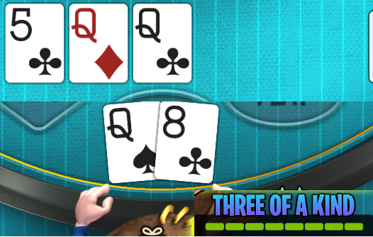

hosted on https://fazt01.github.io/poker-winrate/

A calculator of win chance in poker (texas hold'em), with a visualisation of distribution of win chances against possible opponent's cards.

# Implementation details
This is a client-only tool, using React for the basic UI interactions, and most of the logic in Rust for performance (and preference) reasons

Notable features:
- JavaScript communication with Rust compiled to WebAssembly (using Rust wasm-bindgen library)
  - propagation of async - Rust logic can take several seconds, and cooperatively yields control back to javascript to not freeze UI.
  - cancellation signal - when input data changes, the currently running calculation is aborted on next yield - Javascript cancellation signal cannot be used directly, so a simple rust object in [signal.rs](rust-wasm/src/signal.rs) creates a rust `Future` that can be controlled from JavaScript to fulfil similar role.
- Exact poker cards calculation - iterates through all possible remaining cards (results are always exactly same, no Monte-carlo simulation)
  - Precalculate pre-flop - when a user selects 2 cards and leaves 5 unknown board (community) cards, the amount of possibilities is "52 choose 7" (~133 mil.)- too large to calculate in few seconds. Therefore, for each pre-flop situations, the aggregated result is prepared before deploying (takes around a day to calculate [here](rust-wasm/src/precalculate_solutions))
- The beautiful graph using svg directly, which was probably more convenient than any graphing library.
    
# Poker related

Disclaimer: this is just a toy tool to help basic intuition and show if there is a possibility to lose and against which cards (on hover). There are better tools online that consider other parts of poker (what action to take, how much to bet), and even solvers that output exact optimal mixed (probabilistic) strategy in any situation.

Some online poker games have a simple slider to show a general strength of player's cards 

But this can be deceiving - is this the best cards I could have had? Is there a chance I could lose? Even with same value on the slider, answer to these questions can differ.

In this project, the same "slider" would look like this

(On horizontal axis there are all possible opponents cards (displayed currently only on hover), and vertical axis shows win(green)/tie(yellow)/loss(red) against each particular hand)

Although these are pretty good cards, there are a few opponent's cards that win around 75% times against me, and almost any opponent's cards have a non-zero chance to win against me.

To better illustrate possible distributions, consider following cards - same player card and different "flop" cards on the table.

Both situations have very similar values of the 4 displayed aggregate statistics, but the distribution has some differences that can change the player's response. In the first situation, player is waiting for the completion of flush or straight, which may or may not come. The win distribution against possible opponent's hand is much more flat - almost all cards have a chance to win against me, and even "better" cards have barely an edge, so there is a little bit less strategy and more luck involved.

In contrast, the second hand has already a completed straight, but is threatened almost exclusively by a flush. If an opponent has already completed a flush, there is no chance to win, so this situation benefits much more from any reads on the opponent's possible cards.
